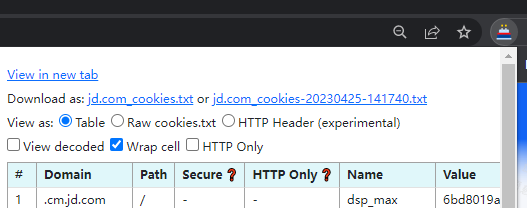
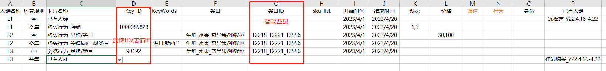
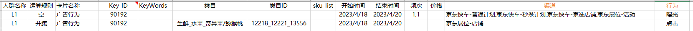
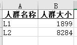

# Predict_AudienceSize

### 关于京东数坊人数计算API接口的调用

#### Step1 ：插件下载，直接获取cookies

#### Step2： 根据相关业务填写data_sheet.xlsx表

1.其中**人群名称、运算规则、卡片名称**为必填单元格 

2.同一个人群包（不得超过30个卡片）的`人群名称`需保持一致，命名规则根据个人可改变，无影响； 

3.若人群包中只有一个卡片，运算规则需填写“空”字，不可省略不填 

4.对于有频次、价格、sku、关键词等限制条件的，逗号需使用英文模式下的逗号，中文模式下的识别可能会出现报错 

5.关于价格，所有维度的价格均为成交价，非京东价 

6.加购行为使用频次不高，暂时还未写……

**目前支持的维度（持续更新中……）**
- 浏览行为_品牌/类目
> **`get_view_data(brand_id, cate_id, start_time, end_time, frequency, price)`** 
> 固定维度为品牌x三级类目、品牌、三级类目维度，根据需求在data_sheet中填写相关的数据
- 浏览行为_店铺
>**`get_view_shop_data(shop_id,start_time, end_time, frequency, price)`** 
>固定维度为店铺内商品维度，此时的Key_ID不是写品牌ID，而是店铺ID
- 购买行为_品牌/类目
> **`get_order_data(brand_id, cate_id, start_time, end_time, frequency, price)`** 
> 固定维度为品牌x三级类目、品牌、三级类目维度，根据需求在data_sheet中填写相关的数据
- 购买行为_店铺
>**`get_order_shop_data(shop_id,start_time, end_time, frequency, price)`** 
>固定维度为店铺内商品维度，此时的Key_ID不是写品牌ID，而是店铺ID
- 购买行为_关键词x三级类目
> **`get_order_keycate_data(shop_id,cate_id,keyWords,start_time, end_time, frequency, price)`** 
>固定维度为关键词x三级类目，此时的Key_ID不填写，需填写KeyWords（关键词）和类目
- 购买行为_SKU
> **`get_order_sku_data(sku_list,start_time, end_time, frequency, price)`** 
>固定维度为SKU维度，其中SKU上限是100个，SKU输入到data_sheet的`sku_list`中
- 已有人群
>**`get_old_data(id_list,name)`**
> 已有人群除必填信息外，其他信息信息无需填写，只需要讲已有人群包的人群包名称填写到`已有人群`列
> 这里需要注意，人群包名称必须和之前创建的人群包名称一致，不可省略。
> id_list是根据cookies抓取的现有账号最新的100条已有人群的ID和人群名称，与填入表格的人群名称进行匹配
- 广告行为
> **`def get_ad_data(cookies,brand_id,cate_id, ad_name, behavior, start_time, end_time, frequency)`**
> 
> 
> 广告行为目前只支持品牌维度、品牌x三级类目，三级类目维度使用场景较少，没写。
> `渠道`对应用广告行为中的产品线,行为对应广告行为中的`行为类型`

#### Step3： 生成的表在output文件夹中的output.xlsx中

